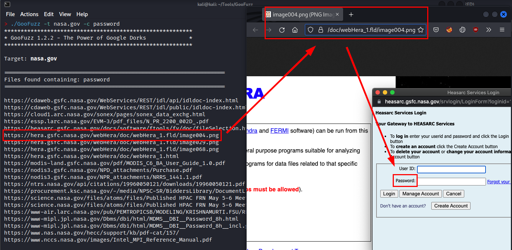
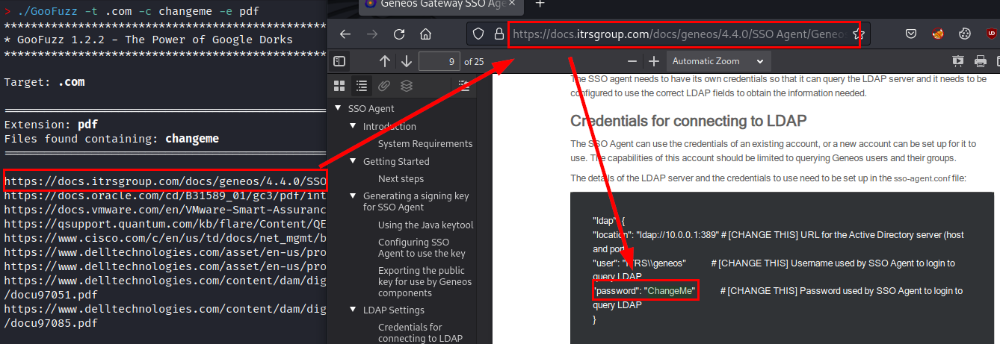

<p align="center">
  
</p>

<p align="center">
  <a href="https://github.com/m3n0sd0n4ld/GooFuzz/releases">
    
  </a>
  <a href="https://www.gnu.org/licenses/gpl-3.0.en.html">
    
  </a>
  <a href="https://github.com/m3n0sd0n4ld/GooFuzz/issues?q=is%3Aissue+is%3Aopen">
    
  <a href="https://github.com/m3n0sd0n4ld/GooFuzz/commits/master">
    
  <a href="">
    
  </a>
  <br>
  <h1 align="center">GooFuzz - The Power of Google Dorks</h1>
  <br>
</p>

## Credits

###### Author: M3n0sD0n4ld
###### Twitter: [@David_Uton](https://twitter.com/David_Uton)

# Description:

**GooFuzz** is a script written in *Bash Scripting* that uses advanced Google search techniques to obtain sensitive information in files or directories without making requests to the web server.

# Download and install:
```
$ git clone https://github.com/m3n0sd0n4ld/GooFuzz.git
$ cd GooFuzz
$ chmod +x GooFuzz
$ ./GooFuzz -h
```

# Docker version:
```
$ git clone https://github.com/m3n0sd0n4ld/GooFuzz
$ cd GooFuzz
$ docker build -t goofuzz .
$ docker run --rm -it goofuzz -h
```

# Use:

## Menu

```
> ./GooFuzz -h
*********************************************************
* GooFuzz 1.2.2 - The Power of Google Dorks             *
*                                                       *
* David Utón (@David_Uton)                              *
*********************************************************

Usage:
        -h                                Display this help message.
        -w <DICTIONARY>        Specify a DICTIONARY, PATHS or FILES.
        -e <EXTENSION>           Specify comma-separated extensions.
        -t <TARGET>                  Specify a DOMAIN or IP Address.
        -p <PAGES>                      Specify the number of PAGES.
        -x <EXCLUSIONS>                EXCLUDES targets in searches.
        -d <DELAY>                Delay in seconds between requests.
        -s                 Lists subdomains of the specified domain.
        -c <TEXT> Specify relevant content in comma-separated files.
        -o <FILENAME>   Export the results to a file (results only).
        -r <PROXY>        Specify an [protocol://]host[:port] proxy.
           
Examples:
        GooFuzz -t site.com -e pdf,doc,bak
        GooFuzz -t site.com -e pdf -p 2
        GooFuzz -t www.site.com -e extensionslist.txt
        GooFuzz -t www.site.com -w config.php,admin,/images/
        GooFuzz -t site.com -w wp-admin -p 1
        GooFuzz -t site.com -w wordlist.txt
        GooFuzz -t site.com -w login.html -x dev.site.com
        GooFuzz -t site.com -w admin.html -x exclusion_list.txt
        GooFuzz -t site.com -s -p 10 -d 5 -o GooFuzz-subdomains.txt
        GooFuzz -t site.com -c P@ssw0rd!
        GooFuzz -t site.com -r http://proxy.example.com:8080
```

## Lists files by extensions separated by commas.
```
> ./GooFuzz -t nasa.gov -e pdf,bak,old -d 10
*********************************************************
* GooFuzz 1.2.2 - The Power of Google Dorks             *
*********************************************************

Target: nasa.gov

===================================================================
Extension: pdf
===================================================================

https://history.nasa.gov/alsj/a11/A11_PressKit.pdf
https://history.nasa.gov/alsj/a13/A13_PressKit.pdf
https://history.nasa.gov/alsj/a14/A14_PressKit.pdf
https://history.nasa.gov/alsj/a15/A15_PressKit.pdf
https://history.nasa.gov/alsj/a410/A07_PressKit.pdf
https://history.nasa.gov/alsj/a410/A09_PressKit.pdf
https://history.nasa.gov/monograph15.pdf
https://www.hq.nasa.gov/alsj/LLRV_Monograph.pdf

===================================================================
Extension: bak
===================================================================

https://bocachica.arc.nasa.gov/ATTREX_2013/rh/rh_omega_oct3.html.bak
https://bocachica.arc.nasa.gov/ATTREX_2013/rh/rh_omega_sep30.html.bak
https://bocachica.arc.nasa.gov/ATTREX_2014/attrex2014_satmap.html.bak
https://bocachica.arc.nasa.gov/ATTREX_2014/schom/schomfigures_20140126.html.bak
https://bocachica.arc.nasa.gov/ATTREX_2014/schom/schomfigures_20140226.html.bak
https://bocachica.arc.nasa.gov/ATTREX_2014/trajfigures/trajfigures.html.bak
https://bocachica.arc.nasa.gov/POSIDON/posidon.html.bak
https://hesperia.gsfc.nasa.gov/hessi/solar_install/installation.bak
https://ndeaa.jpl.nasa.gov/nasa-nde/outreach/outreach.html.bak
https://ndeaa.jpl.nasa.gov/nasa-nde/yosi/yosi.htm.bak

===================================================================
Extension: old
===================================================================

https://bocachica.arc.nasa.gov/HAVE/nmc_rh_omega_plots.html.old
https://echo.jpl.nasa.gov/asteroids/1988TA/1988TA_planning.html.old
https://echo.jpl.nasa.gov/asteroids/1998QE2/1998QE2_planning.html.old
https://echo.jpl.nasa.gov/asteroids/2014JO25/2014JO25_planning.html.old
https://echo.jpl.nasa.gov/asteroids/goldstone_asteroid_schedule.html.old
https://fits.gsfc.nasa.gov/users_guide/users_guide.ps.old
https://image.msfc.nasa.gov/ChrisDocs/UDFInstall/uLibInstall.old
https://seawifs.gsfc.nasa.gov/OCEAN_PLANET/HTML/titanic.html.old
https://umbra.nascom.nasa.gov/soho/hga_history.html.old
https://www.nasa.gov/index.html.old
```

## Lists files by extensions contained in a txt file.
```
> ./GooFuzz -t nasa.gov -e wordlists/extensions.txt -d 30
*********************************************************
* GooFuzz 1.2.2 - The Power of Google Dorks             *
*********************************************************

Target: nasa.gov
Total requests: 4

===================================================================
Extension: pdf
===================================================================

https://history.nasa.gov/alsj/a11/A11_PressKit.pdf
https://history.nasa.gov/alsj/a13/A13_PressKit.pdf
https://history.nasa.gov/alsj/a14/A14_PressKit.pdf
https://history.nasa.gov/alsj/a15/A15_PressKit.pdf
https://history.nasa.gov/alsj/a410/A09_PressKit.pdf
https://oig.nasa.gov/NASA2011MajorChallenges.pdf
https://solarsystem.nasa.gov/stardust/aerogel_factsheet.pdf
https://www.hq.nasa.gov/alsj/LLRV_Monograph.pdf

===================================================================
Extension: xls
===================================================================

https://oig.nasa.gov/NASA_OIG_FY2013_Recovery_Act_Work_Plan.xls
https://www.nasa.gov/xls/163559main_LunarExplorationObjectives.xls
https://www.nasa.gov/xls/209970main_acr_section_c_icac_redacted_final_rev8_fixed.xls
https://www.nasa.gov/xls/220716main_Ch2_6TV.xls
https://www.nasa.gov/xls/279268main_Bird_Strikes.xls
https://www.nasa.gov/xls/279283main_Collided_Nearly_Collided_With_Another_Aircraft_While_Both_on_Ground.xls
https://www.nasa.gov/xls/279298main_Flight_Operations_Quality_Assurance_Program.xls
https://www.nasa.gov/xls/279309main_Location_Aircraft_Unrequested_Clearance_Change.xls
https://www.nasa.gov/xls/279532main_Runway_Taxiway_Excursions.xls
https://www.nasa.gov/xls/279539main_Takeoffs_With_Out_of_Limit_Center_of_Gravity.xls

===================================================================
Extension: doc
===================================================================

https://cce.nasa.gov/te2010_ab_presentations/Breakout_report.doc
https://hdrl.gsfc.nasa.gov/LWS_Data_System_Final.doc
https://pumas.nasa.gov/files/01_06_14_1.doc
https://www.nasa.gov/279987main_0929MT.DOC
https://www.nasa.gov/88878main_C_PDP03.DOC
https://www.nasa.gov/doc/311200main_SELDP_Guideline_Rev_01262009.doc
https://www.nasa.gov/doc/378831main_Huntsville_Transcript_part5.doc

===================================================================
Extension: txt
===================================================================

https://aeronet.gsfc.nasa.gov/aeronet_locations.txt
https://atmcorr.gsfc.nasa.gov/actual_holdings.txt
https://fits.gsfc.nasa.gov/rfc4047.txt
https://leonid.arc.nasa.gov/02comment66.txt
https://leonid.arc.nasa.gov/99comment10.txt
https://leonid.arc.nasa.gov/comment36.txt
https://www.nasa.gov/190381main_Feldman-transcript.txt
https://www.nasa.gov/366950main_1.txt
https://www.nasa.gov/378571main_0728NASAMeeting.txt
https://www.nasa.gov/382774main_081209_DC_Transcript.txt
```
## List files, directories and even parameters by means of a wordlist (it is recommended to use only very small files).
```
./GooFuzz -t nasa.gov -w wordlists/words-100.txt -p 3
*********************************************************
* GooFuzz 1.2.2 - The Power of Google Dorks             *
*********************************************************

Target: nasa.gov

===================================================================
Directories and files found from: wordlists/words-100.txt
===================================================================

https://aeronet.gsfc.nasa.gov/cgi-bin/bamgomas_interactive
https://aeronet.gsfc.nasa.gov/cgi-bin/draw_map_display_aod_v3
https://aeronet.gsfc.nasa.gov/cgi-bin/webtool_aod_v3
https://cdaweb.gsfc.nasa.gov/cgi-bin/eval2.cgi
https://heasarc.gsfc.nasa.gov/cgi-bin/tess/webtess/wtv.py
https://heasarc.gsfc.nasa.gov/cgi-bin/Tools/convcoord/convcoord.pl
https://heasarc.gsfc.nasa.gov/cgi-bin/Tools/w3nh/w3nh.pl
https://heasarc.gsfc.nasa.gov/cgi-bin/Tools/w3pimms/w3pimms.pl
https://heasarc.gsfc.nasa.gov/cgi-bin/Tools/xraybg...
https://heasarc.gsfc.nasa.gov/cgi-bin/Tools/xraybg/xraybg.pl
https://heasarc.gsfc.nasa.gov/cgi-bin/W3Browse/swift.pl
https://heasarc.gsfc.nasa.gov/cgi-bin/W3Browse/w3browse.pl
https://heasarc.gsfc.nasa.gov/cgi-bin/W3Browse/w3catindex.pl
https://landweb.modaps.eosdis.nasa.gov/cgi-bin/QA_WWW/qaFlagPage.cgi?sat
https://landweb.modaps.eosdis.nasa.gov/cgi-bin/QA_WWW/qaFlagPage.cgi?sat=terra
https://landweb.modaps.eosdis.nasa.gov/cgi-bin/QA_WWW/qaFlagPage.cgi?sat=terra%26ver=C6
https://sscweb.gsfc.nasa.gov/cgi-bin/Locator.cgi
https://stereo.gsfc.nasa.gov/cgi-bin/images
https://stereo-ssc.nascom.nasa.gov/cgi-bin/images
https://svs.gsfc.nasa.gov/cgi-bin/details.cgi?aid
https://svs.gsfc.nasa.gov/cgi-bin/details.cgi?aid=4285
https://uavsar.jpl.nasa.gov/cgi-bin/data.pl?search
https://uavsar.jpl.nasa.gov/cgi-bin/data.pl?search=10G004
https://uavsar.jpl.nasa.gov/cgi-bin/data.pl?search=11G020
https://uavsar.jpl.nasa.gov/cgi-bin/data.pl?search=11G032
https://uavsar.jpl.nasa.gov/cgi-bin/data.pl?search=12G008
https://uavsar.jpl.nasa.gov/cgi-bin/data.pl?search=12G028
https://uavsar.jpl.nasa.gov/cgi-bin/data.pl?search=13G019
https://uavsar.jpl.nasa.gov/cgi-bin/data.pl?search=14G009
https://uavsar.jpl.nasa.gov/cgi-bin/data.pl?search=19G014
https://uavsar.jpl.nasa.gov/cgi-bin/data.pl?search=20G024
https://uavsar.jpl.nasa.gov/cgi-bin/data.pl?search=22G012
https://uavsar.jpl.nasa.gov/cgi-bin/data.pl?search=9G023
```

## Lists directories and files by specifying paths, words or file names.
```
> ./GooFuzz -t nasa.gov -w /login/,password,db.html -p 3
*********************************************************
* GooFuzz 1.2.2 - The Power of Google Dorks             *
*********************************************************

Target: nasa.gov

===================================================================
Directories and files found from: /login/,password,db.html
===================================================================

https://femci.gsfc.nasa.gov/random/dB.html
https://heasarc.gsfc.nasa.gov/ark/forgot/password.html
https://osdr.nasa.gov/bio/submission-sso-login.html
https://osdr.nasa.gov/bio/workspace-sso-login.html
https://pubs.giss.nasa.gov/authors/db.html
https://wwwastro.msfc.nasa.gov/qdp/lextrct/db.html
https://www-mipl.jpl.nasa.gov/vicar/core460/html/javadoc/index.html?jpl/mipl/jujube/servlet/Login.html
https://www-mipl.jpl.nasa.gov/vicar/core460/html/javadoc/index.html?jpl/mipl/mdms/FileService/komodo/services/query/server/Login.html
https://www-mipl.jpl.nasa.gov/vicar/core460/html/javadoc/jpl/mipl/mdms/FileService/komodo/services/query/server/Login.html
https://www-mipl.jpl.nasa.gov/vicar/core470/html/javadoc/index.html?jpl/mipl/jujube/servlet/Login.html
https://www-mipl.jpl.nasa.gov/vicar/core470/html/javadoc/index.html?jpl/mipl/mdms/FileService/komodo/services/query/server/Login.html
https://www-mipl.jpl.nasa.gov/vicar/core470/html/javadoc/jpl/mipl/jujube/servlet/Login.html
https://www-mipl.jpl.nasa.gov/vicar/core470/html/javadoc/jpl/mipl/mdms/FileService/komodo/services/query/server/Login.html
```
  
## Exclusion of subdomains in your searches (separated by commas or by a list)
### Example 1:
In this example we remove the subdomain "*wiki.earthdata.nasa.gov*" from the search.

```
> ./GooFuzz -t nasa.gov -w login -p 1
*********************************************************
* GooFuzz 1.2.2 - The Power of Google Dorks             *
*********************************************************

Target: nasa.gov

===================================================================
Directories and files found from: login
===================================================================

https://daac.gsfc.nasa.gov/login
https://disc.gsfc.nasa.gov/earthdata-login
https://disc.gsfc.nasa.gov/images/login1.png
https://disc.gsfc.nasa.gov/images/login4.png
https://disc.gsfc.nasa.gov/images/login5.png
https://disc.gsfc.nasa.gov/images/login6.png
https://invention.nasa.gov/prog/login
https://kauai.ccmc.gsfc.nasa.gov/DONKI/login
https://ladsweb.modaps.eosdis.nasa.gov/oauth/login
https://software.nasa.gov/login
https://stemgateway.nasa.gov/public/s/login/
https://technology.nasa.gov/login
https://wiki.earthdata.nasa.gov/display/EL/How
https://wiki.earthdata.nasa.gov/download/attachments/109874707/home _register.png?version
https://wiki.earthdata.nasa.gov/download/attachments/109874707/registration2.png?version
https://wiki.earthdata.nasa.gov/login.action
https://www.earthdata.nasa.gov/eosdis/science-system-description/eosdis-components/earthdata-login
https://www.earthdata.nasa.gov/sites/default/files/imported/EDL_1.jpg
https://www.earthdata.nasa.gov/sites/default/files/imported/EDL_2.jpg
https://www.earthdata.nasa.gov/sites/default/files/imported/EDL_4.jpg
https://www.earthdata.nasa.gov/sites/default/files/imported/EDL_5.jpg
https://www.jpl.nasa.gov/site/NSET/accounts/login/
                                                                                                                                         
> ./GooFuzz -t nasa.gov -w login -p 1 -x wiki.earthdata.nasa.gov
*********************************************************
* GooFuzz 1.2.2 - The Power of Google Dorks             *
*********************************************************

Target: nasa.gov

===================================================================
Directories and files found from: login
===================================================================

https://daac.gsfc.nasa.gov/login
https://disc.gsfc.nasa.gov/earthdata-login
https://disc.gsfc.nasa.gov/images/login1.png
https://disc.gsfc.nasa.gov/images/login4.png
https://disc.gsfc.nasa.gov/images/login5.png
https://disc.gsfc.nasa.gov/images/login6.png
https://invention.nasa.gov/assets/images/banner-meatball.png
https://invention.nasa.gov/prog/login
https://ladsweb.modaps.eosdis.nasa.gov/login
https://ladsweb.modaps.eosdis.nasa.gov/oauth/login
https://software.nasa.gov/login
https://stemgateway.nasa.gov/public/s/login/
https://technology.nasa.gov/login
https://www.earthdata.nasa.gov/eosdis/science-system-description/eosdis-components/earthdata-login
https://www.earthdata.nasa.gov/sites/default/files/imported/EDL_1.jpg
https://www.earthdata.nasa.gov/sites/default/files/imported/EDL_2.jpg
https://www.earthdata.nasa.gov/sites/default/files/imported/EDL_3.jpg
https://www.earthdata.nasa.gov/sites/default/files/imported/EDL_4.jpg
https://www.earthdata.nasa.gov/sites/default/files/imported/EDL_5.jpg
```

### Example 2:
Using the previous example, we create a file called "*exclusion_list.txt*" and insert the three subdomains to exclude, we perform the same search again, but passing the list of excluded targets.
  
```
> cat exclusion-list.txt
daac.gsfc.nasa.gov
invention.nasa.gov
software.nasa.gov
                                                                                                                                         
> ./GooFuzz -t nasa.gov -w login -p 1 -x exclusion-list.txt
*********************************************************
* GooFuzz 1.2.2 - The Power of Google Dorks             *
*********************************************************

Target: nasa.gov

===================================================================
Directories and files found from: login
===================================================================

https://disc.gsfc.nasa.gov/earthdata-login
https://ladsweb.modaps.eosdis.nasa.gov/oauth/login
https://nightsky.jpl.nasa.gov/login.cfm
https://podaac-tools.jpl.nasa.gov/drive/login?action
https://podaac-tools.jpl.nasa.gov/drive/login?action=login
https://stemgateway.nasa.gov/public/s/login/
https://technology.nasa.gov/login
https://wiki.earthdata.nasa.gov/login.action
https://www.earthdata.nasa.gov/eosdis/science-system-description/eosdis-components/earthdata-login
https://www.jpl.nasa.gov/site/NSET/accounts/login/
https://www.sewp.nasa.gov/qrt/security/login.sa
```

## Subdomains enumeration
The functionality to list subdomains (parameter "*-s*") and in conjunction with a number of between 10 and 20 pages (parameter "*-p*"), it is possible to obtain a large number of subdomains of the organization.

```
> ./GooFuzz -t nasa.gov -s -p 20
*********************************************************
* GooFuzz 1.2.2 - The Power of Google Dorks             *
*********************************************************

Target: nasa.gov

===================================================================
Subdomains found:
===================================================================

http://go.nasa.gov
https://aeronet.gsfc.nasa.gov
https://airs.jpl.nasa.gov
https://api.nasa.gov
https://apod.nasa.gov
https://appel.nasa.gov
https://ares.jsc.nasa.gov
https://asterweb.jpl.nasa.gov
https://astrobiology.nasa.gov
https://blogs.nasa.gov
https://ceres.larc.nasa.gov
https://climatekids.nasa.gov
https://climate.nasa.gov
https://cneos.jpl.nasa.gov
https://data.nasa.gov
https://earthobservatory.nasa.gov
https://europa.nasa.gov
https://exoplanets.nasa.gov
https://eyes.nasa.gov
https://firms.modaps.eosdis.nasa.gov
https://go.nasa.gov
https://imagine.gsfc.nasa.gov
https://intern.nasa.gov
https://lambda.gsfc.nasa.gov
https://mars.nasa.gov
https://missionstem.nasa.gov
https://mms.gsfc.nasa.gov
https://modis.gsfc.nasa.gov
https://ntrs.nasa.gov
https://power.larc.nasa.gov
https://science.gsfc.nasa.gov
https://science.nasa.gov
https://sdo.gsfc.nasa.gov
https://search.earthdata.nasa.gov
https://smap.jpl.nasa.gov
https://software.nasa.gov
https://solarsystem.nasa.gov
https://spaceplace.nasa.gov
https://spotthestation.nasa.gov
https://swot.jpl.nasa.gov
https://terra.nasa.gov
https://webb.nasa.gov
https://worldview.earthdata.nasa.gov
https://worldwind.arc.nasa.gov
https://www1.grc.nasa.gov
https://www.earthdata.nasa.gov
https://www.giss.nasa.gov
https://www.jpl.nasa.gov
https://www.sewp.nasa.gov
https://www.sti.nasa.gov
```

## Files found containing enumeration
The functionality to list files by their content (parameter "*-c*"), is very useful to identify relevant files (e.g. containing the word "*password*"), even if the word is in an image file (e.g. *.png*).

```
> ./GooFuzz -t nasa.gov -c password
*********************************************************
* GooFuzz 1.2.2 - The Power of Google Dorks             *
*********************************************************

Target: nasa.gov

===================================================================
Files found containing: password
===================================================================

https://cdaweb.gsfc.nasa.gov/WebServices/REST/idl/api/idldoc-index.html
https://cdaweb.gsfc.nasa.gov/WebServices/REST/idl/public/idldoc-index.html
https://cloud1.arc.nasa.gov/sonex/pages/sonex_data_exchg.html
https://essp.larc.nasa.gov/EVM-3/pdf_files/N_PR_2200_002D_.pdf
https://heasarc.gsfc.nasa.gov/docs/software/ftools/fv/doc/fileSelection.html
https://hera.gsfc.nasa.gov/webHera/doc/webHera_1.fld/image004.png
https://hera.gsfc.nasa.gov/webHera/doc/webHera_1.fld/image029.png
https://hera.gsfc.nasa.gov/webHera/doc/webHera_1.fld/image068.png
https://hera.gsfc.nasa.gov/webHera/doc/webHera_1.html
https://modis-land.gsfc.nasa.gov/pdf/MODIS_C6_BA_User_Guide_1.0.pdf
https://nodis3.gsfc.nasa.gov/NPD_attachments/Purchase.pdf
https://nodis3.gsfc.nasa.gov/NPR_attachments/NRRS_1441.1.pdf
https://ntrs.nasa.gov/api/citations/19960050121/downloads/19960050121.pdf
https://procurement.ksc.nasa.gov/-/media/NPSC-SR/BiddersLibrary/DocumentLibrary/NRRS 14411 NASA Record Retention Schedules.ashx
https://science.nasa.gov/files/atoms/files/Published HPAC FRN May 5-6 Meeting
https://science.nasa.gov/files/atoms/files/Published HPAC FRN May 5-6 Meeting%5B1%5D.pdf
https://www-air.larc.nasa.gov/pub/PEMTROPICSB/MODELING/KRISHNAMURTI.FSU/README.txt
https://www-mipl.jpl.nasa.gov/Dbms/dbi/html/MDMS__DBI__Password_8h.html
https://www-mipl.jpl.nasa.gov/Dbms/dbi/html/MDMS__DBI__Password_8h__incl.gif
https://www.nas.nasa.gov/hecc/support/kb/pdf-cat/157/
https://www.nccs.nasa.gov/images/Intel_MPI_Reference_Manual.pdf
```

#### Proof of concept with an image


Or even, search for a possible password in a pdf file:

```
> ./GooFuzz -t .com -c changeme -e pdf
*********************************************************
* GooFuzz 1.2.2 - The Power of Google Dorks             *
*********************************************************

Target: .com

===================================================================
Extension: pdf
Files found containing: changeme
===================================================================

https://docs.itrsgroup.com/docs/geneos/4.4.0/SSO Agent/Geneos SSO User Guide v1.0.0.pdf
https://docs.oracle.com/cd/B31589_01/gc3/pdf/integration/gc3datamanagement.pdf
https://docs.vmware.com/en/VMware-Smart-Assurance/10.1.5/sm-pub-smarts-security-config-guide-1015.pdf
https://qsupport.quantum.com/kb/flare/Content/QEKM/Downloads/6-01847-02_Q-EKM_UsersGuide.pdf
https://www.cisco.com/c/en/us/td/docs/net_mgmt/broadband_access_center/3-6/administration/guide/admbac36/chap_20.pdf
https://www.delltechnologies.com/asset/en-us/products/data-protection/technical-support/docu96471.pdf
https://www.delltechnologies.com/asset/en-us/products/data-protection/technical-support/docu97051.pdf
https://www.delltechnologies.com/content/dam/digitalassets/active/en/unauth/technical-guides-support-information/products/data-protection/docu97051.pdf
https://www.delltechnologies.com/content/dam/digitalassets/active/en/unauth/technical-guides-support-information/products/data-protection/docu97085.pdf
```

#### Proof of concept with an PDF file

    
# Disclaimer
- I am not responsible for the misuse of the tool.
- Google Search has mechanisms to prevent abusive use or detection of suspicious activity. If at any time the tool does not show results, Google has temporarily blocked you (e.g. Captcha).
- All the information obtained is public and through Google results. 
- Logically, the searches are in Google, so it leaves no evidence in the logs of the target's server.
- And very important, if you see a file, directory, subdomain, etc... Indexed in Google, does not mean that it still exists on the server (or it does ;)).

# Useful?
If you like the tool, find it useful in your work, Bug Bounty or as a hobby, you could help me like this:
- Tell your friends and co-workers about it.
- Contribute new ideas or help me to improve it by correcting bugs from [**here**](https://github.com/m3n0sd0n4ld/GooFuzz/issues).
- How? Do you want to buy me a coffee? Thank you very much! 

<p align="left">
  <a href="https://www.paypal.com/paypalme/elmalodebatman" target="_blank">
    </img></a>
</p>
